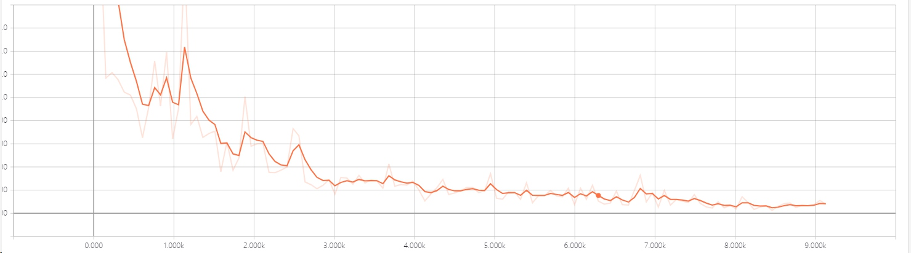
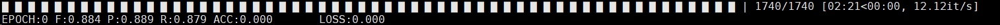

# bert_Bilstm_Crf
+ bert-as-service:https://github.com/hanxiao/bert-as-service
+ https://github.com/google-research/bert
+ BiLSTM-CRF:https://github.com/kyzhouhzau/

Sequence_Labeling
This model based on google's Bert and hanxiao's bert-as-service this just a try to use bert in a word-embedding mode.
This model still has some problems need to solve.
such as:
1. the bert-service can catch the speed of model training.
2. should i use trainable=True for each embeddings in each sentence
3. The result on dev data was not very perfect!
4. only trained 9177 batch. if more maybe better!
5. others
Run:
First:start bert service
```
bert-serving-start -max_seq_len 250 -pooling_strategy NONE -pooling_layer -4 -3 -2 -1 -model_dir /home/kyzhou/bert/uncased_L-12_H-768_A-12 -num_wor 4
```
Second:
```
python train.py
```
Third:
```
python eval.py
```
Result:
loss:



on dev set:




